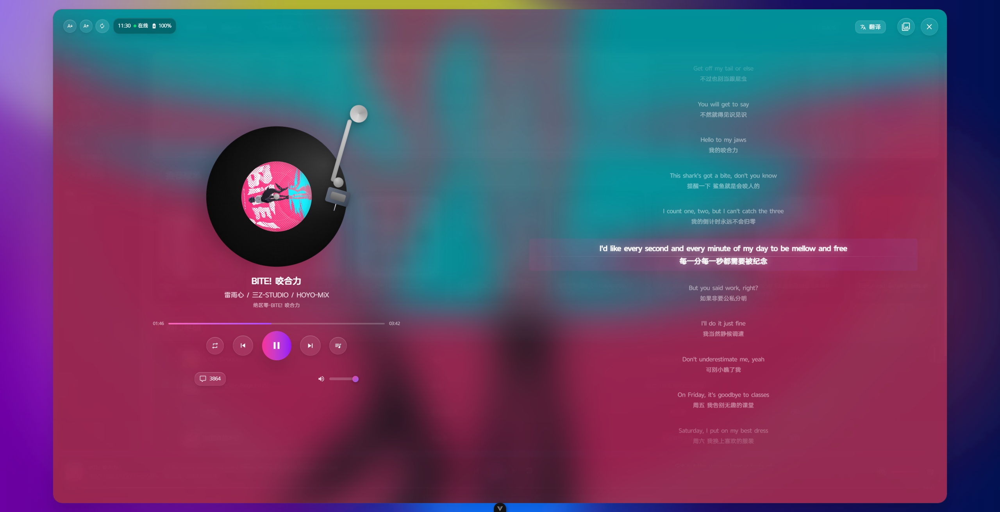
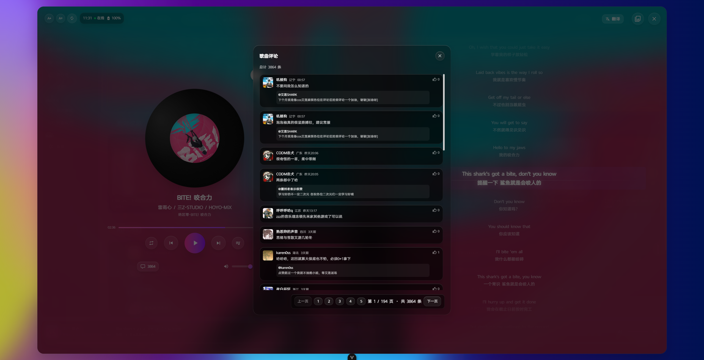
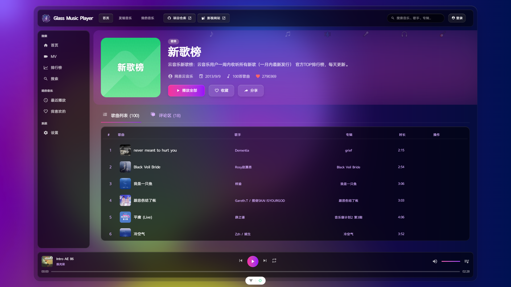
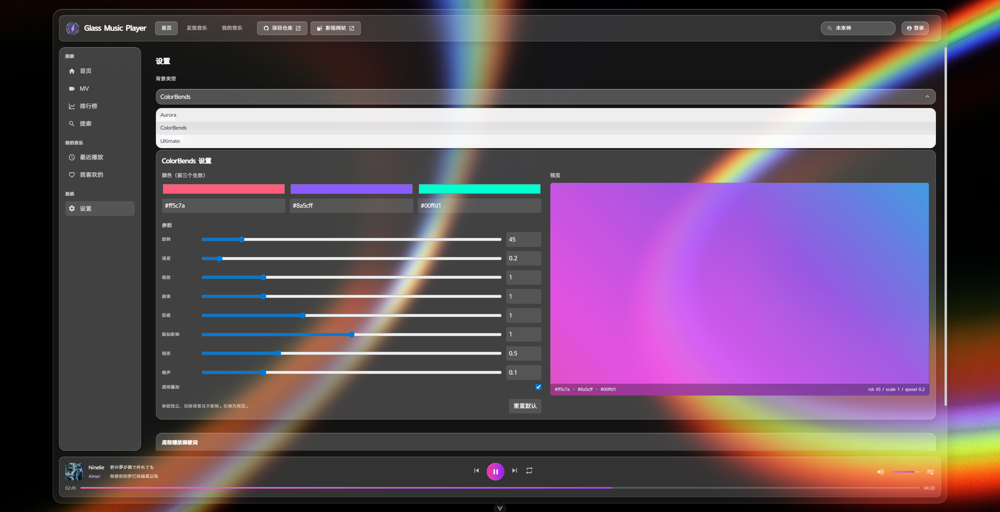
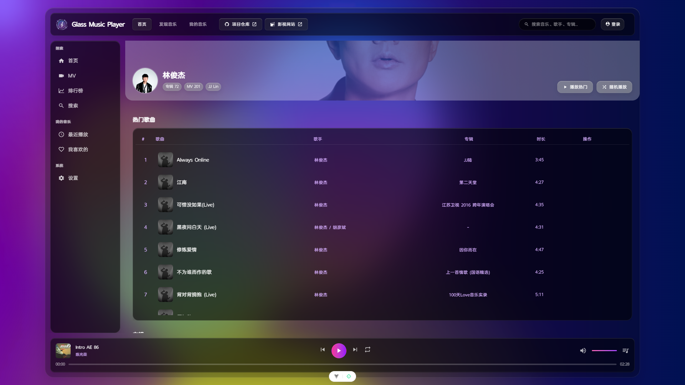
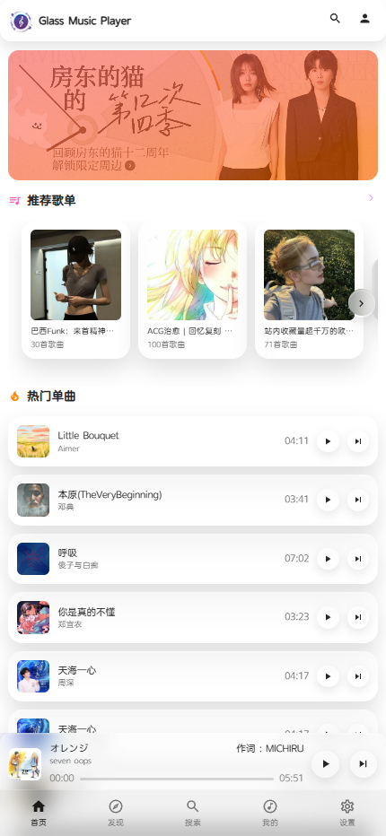
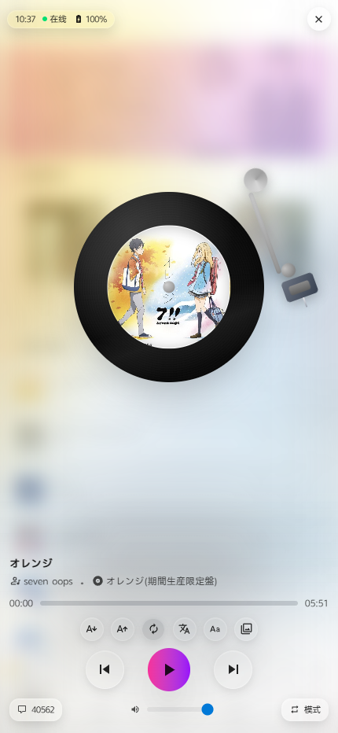
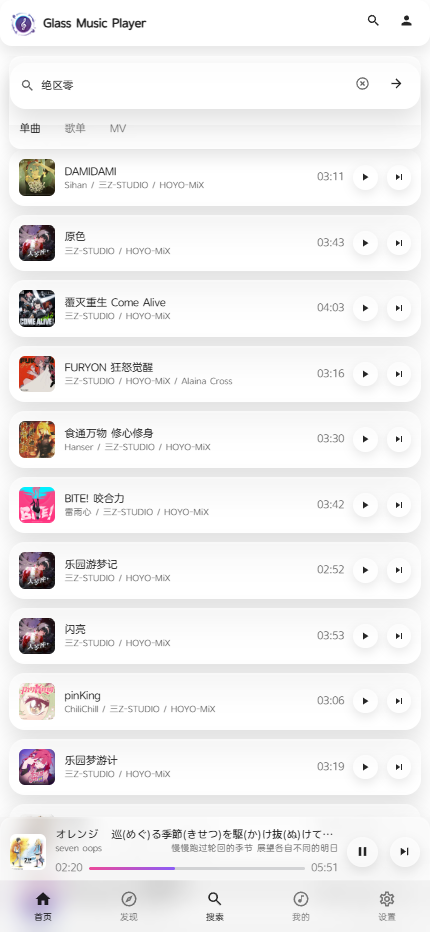
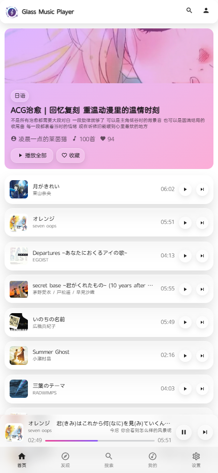
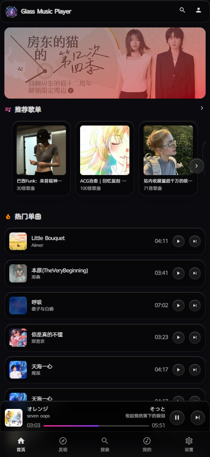

🎵 **提示：** 旧项目已迁移至分支 👇
[GlassMusicPlayer/GlassMusicPlayer-V1 分支](https://github.com/XiangZi7/GlassMusicPlayer/tree/GlassMusicPlayer-V1)
[GlassMusicPlayer/kmmusic 分支](https://github.com/XiangZi7/GlassMusicPlayer/tree/kmmusic)

<div align="center">

# 🎵 Glass Music Player

**简约高颜值的毛玻璃风格 Web 音乐播放器**

[](https://vuejs.org/)
[](https://vitejs.dev/)
[](https://tailwindcss.com/)
[](https://pinia.vuejs.org/)
[](LICENSE)

[在线预览](https://topm.netlify.app) · [GitHub 仓库](https://github.com/XiangZi7/KM-Music-Player) · [API 文档](https://neteasecloudmusicapi.vercel.app/#/)

</div>


## ✨ 特性

- 🎨 **毛玻璃设计** - 现代化 UI 设计，精致的毛玻璃视觉效果
- 🌓 **双主题支持** - 浅色/深色主题，支持系统主题跟随
- 📱 **响应式布局** - 完美适配 PC 与 Mobile 端
- 🌍 **国际化** - 支持中文 / English / 日本語
- ⚡ **高性能** - 基于 Vue 3.5 + Vite 7 构建，极致性能体验

## 🔨 功能特性

### 🎨 主题与视觉
| 功能 | 描述 |
|------|------|
| 双主题模式 | 浅色/深色主题，CSS 变量驱动，全站一致性 |
| 系统主题跟随 | 自动适配系统深浅色模式 |
| 背景主题 | Aurora / ColorBends / Ultimate 三种背景可选 |
| 毛玻璃效果 | 全局毛玻璃质感，登录框、播放器、下拉菜单等组件统一风格 |

### 🏠 主页与列表
| 功能 | 描述 |
|------|------|
| 首页布局 | 重构优化的首页布局，提升交互体验 |
| 推荐歌单 | 卡片统一尺寸，左右箭头翻页 |
| 歌单/MV 列表 | 加载骨架屏，流畅过渡 |
| 排行榜 | 多类型切换（全部/华语/欧美/日本/韩国） |
| 播放列表气泡 | 拖拽排序、下一首播放、批量删除、清空列表 |
| 图片懒加载 | LazyImage 组件优化图片加载性能 |

### 🎹 侧边栏菜单
| 功能 | 描述 |
|------|------|
| 探索分组 | 首页、MV、排行榜、艺术家、新碟上架、搜索 |
| 我的音乐 | 我的音乐、我喜欢的 |
| 系统 | 设置 |

### 🔍 搜索功能
| 功能 | 描述 |
|------|------|
| 搜索联想 | 实时下拉联想，歌曲/歌单快速访问 |
| 搜索历史 | 本地记录搜索历史，一键清除，点击外部自动关闭 |
| 搜索分页 | 支持大量搜索结果分页浏览 |

### 📄 详情页面
| 页面 | 功能 |
|------|------|
| 歌曲详情 | 歌词全文、相似歌曲/歌单推荐、评论弹窗 |
| 歌手页 | 头像英雄区 + 浮动音符动画、热门歌曲/专辑Tab切换、播放热门/随机播放 |
| 专辑页 | 封面英雄区、发行信息、简介折叠、曲目列表 |
| MV 页 | 高清视频播放、HLS 流媒体支持 |

### 🎵 播放器
| 功能 | 描述 |
|------|------|
| 黑胶唱片风格 | 写实黑胶唱片 + 唱臂动画，播放时唱臂落下 |
| 进度条拖拽 | 丝滑拖拽、悬停显示圆形手柄、光晕效果 |
| 封面背景 | 双层淡入淡出、模糊放大背景切换 |
| 主题快捷切换 | 播放器内快速切换浅色/暗黑/跟随系统 |
| 设备状态 | 显示电池电量、充电状态、网络状态 |

### 🎤 歌词功能
| 功能 | 描述 |
|------|------|
| 多语言歌词 | 原文/译文/罗马音切换显示 |
| 歌词缩放 | 字体大小自由调节 |
| 自动滚动 | 歌词自动跟随播放进度 |
| 拖动定位 | 拖动歌词快速定位播放位置 |
| 时间预览 | 拖动时显示时间预览 |

### 🎤 艺术家与专辑
| 功能 | 描述 |
|------|------|
| 艺术家列表 | 全新艺术家页面，按类型/地区/首字母筛选，支持分页加载 |
| 新碟上架 | 全新新碟页面，按地区筛选（全部/华语/欧美/日本/韩国） |
| 艺术家详情页 | 头像英雄区 + 浮动音符动画、Tab 切换热门歌曲/专辑 |
| 专辑卡片 | 悬停放大 + 播放图标覆盖层 |

### 💬 评论系统
| 功能 | 描述 |
|------|------|
| 分页浏览 | 支持大量评论分页 |
| 信息展示 | IP 归属地、发布时间显示 |
| 楼中楼 | 支持嵌套回复展示 |

### 📱 移动端适配
| 功能 | 描述 |
|------|------|
| 响应式布局 | 完美适配各尺寸移动设备 |
| 触控优化 | 手势操作，流畅交互 |
| 底部导航 | 移动端专属底部标签栏 |
| 播放器抽屉 | 全屏播放器，毛玻璃效果 |
| 最近播放 | 移动端最近播放页面 |
| 搜索分页 | 移动端搜索支持分页功能 |

### 🧭 导航与交互
| 功能 | 描述 |
|------|------|
| 侧边栏分组 | 探索/我的音乐/系统，清晰分类 |
| 顶部导航 | 项目仓库、影视站外链直达 |
| 快捷操作 | 下一首播放、添加到播放列表 |

### 🌍 多语言支持
| 语言 | 支持状态 |
|------|------|
| 简体中文 | ✅ 完整支持 |
| English | ✅ 完整支持 |
| 日本語 | ✅ 完整支持 |

## 🛠 技术栈

| 类别 | 技术 |
|------|------|
| 框架 | Vue 3.5 |
| 构建 | Vite 7 |
| 状态管理 | Pinia |
| 样式 | Tailwind CSS 4 |
| 路由 | Vue Router 4 |
| 国际化 | Vue I18n 11 |
| 动画 | GSAP |
| 视频播放 | Artplayer + HLS.js |
| 其他 | Swiper、Three.js、OGL、Lottie |

## ⚙️ 系统需求

- **Node.js** >= 22

## 📦 安装使用

### 克隆项目

```bash
git clone https://github.com/XiangZi7/GlassMusicPlayer.git
cd GlassMusicPlayer
```

### 安装依赖

```bash
pnpm install
```

### 配置环境变量

修改 `.env` 文件：

```env
# 本地环境接口地址
VITE_APP_BASE_API = '你的网易云接口地址'
```

### 启动开发服务器

```bash
pnpm dev
```

## 📷 项目截图

### 桌面端













### 移动端








## 🧩 API 接口

- [网易云音乐 API](https://neteasecloudmusicapi.vercel.app/#/)（可能需魔法上网）

## ❓ 常见问题

**Q: 如何解决启动错误？**

请确保 Node.js 版本 >= 22，并检查依赖安装时的错误信息。

**Q: 播放器如何更改主题？**

在侧边菜单栏选择「设置」，可切换主题模式和背景主题。

## ⚠️ 免责声明

Glass Music Player 项目仅用于学习和研究目的。使用该项目的用户需自行承担相关风险。本项目所使用的相关 API 和数据源均为第三方提供，使用时请遵循相关法律法规及第三方的使用条款。本项目不得用于任何商业目的，我们不对任何由于使用本项目而引起的直接或间接的损失或法律责任负责。

## 👨‍👨‍👦‍👦 QQ 交流群


## ❤️ 捐赠

如果觉得该项目对你有帮助或喜欢，欢迎投食~

<table>
  <tr>
    <td align="center">
      <strong>支付宝</strong><br/>
      
    </td>
    <td align="center">
      <strong>微信</strong><br/>
      
    </td>
  </tr>
</table>

## 📈 Star 趋势

[](https://starchart.cc/XiangZi7/KM-Music-Player)

## 📄 License

[PolyForm-Noncommercial-1.0.0](LICENSE)
