🎵 **提示：** 旧项目已迁移至分支 👇
[GlassMusicPlayer/GlassMusicPlayer-V1 分支](https://github.com/XiangZi7/GlassMusicPlayer/tree/GlassMusicPlayer-V1)
[GlassMusicPlayer/kmmusic 分支](https://github.com/XiangZi7/GlassMusicPlayer/tree/kmmusic)

<div align="center">

## 🛠 技术栈

<p align="center">


</p>
<p align="center">


</p>

<p align="center">
  <a href="https://gm-doc.pages.dev/" target="_blank" style="display:inline-block; padding:10px 18px; border-radius:12px; background: linear-gradient(90deg, #8b5cf6, #ec4899); color:#fff; font-weight:700; text-decoration:none; box-shadow: 0 4px 12px rgba(236,72,153,0.3);">📘 项目文档</a>
</p>

[项目文档](https://gm-doc.pages.dev/) · [在线预览](https://topm.pages.dev/) · [GitHub 仓库](https://github.com/XiangZi7/KM-Music-Player) · [API 文档](https://neteasecloudmusicapi.vercel.app/#/)

</div>


## ✨ 核心特性

- 🎨 **毛玻璃设计** - 现代化 UI，精致视觉效果
- 🌓 **双主题切换** - 浅色/深色主题，支持系统跟随，三种背景主题
- 🎵 **音频可视化** - 实时频谱/波形/圆形可视化，自适应主题配色
- 📱 **响应式布局** - 完美适配桌面端与移动端
- 🌍 **国际化支持** - 中文 / English / 日本語

## 🎬 主要功能

### 🎵 播放器
黑胶唱片动画 · 实时音频可视化 · 音质选择 · 歌词同步 · 进度拖拽 · 路由过渡动画

### 🏠 发现音乐
首页推荐 · 排行榜 · 艺术家 · 新碟 · 歌单

### 🔍 搜索
实时联想 · 历史记录 · 歌曲/歌单/MV/艺术家

### 📱 移动端优化
底部导航 · 全屏播放器抽屉 · 滑动切换 · 触控手势

<details>
<summary><strong>📋 查看完整功能列表</strong></summary>
<br/>

| 模块 | 功能 |
|------|------|
| **主题视觉** | 双主题模式 · 系统跟随 · 三种背景主题 · 毛玻璃效果 · 动态颜色适配 · 路由过渡动画 |
| **首页列表** | 卡片化布局 · 推荐歌单 · 骨架屏加载 · 图片懒加载 |
| **排行榜** | 多类型切换（华语/欧美/日本/韩国） · 分页加载 |
| **搜索** | 实时联想 · 历史记录 · 分页浏览 · 外部点击关闭 · 滑动切换 |
| **歌曲详情** | 歌词全文 · 相似推荐 · 评论弹窗 · 相关MV |
| **艺术家** | 类型/地区/首字母筛选 · 分页 · 英雄区动画 · 热门/专辑Tab |
| **专辑** | 封面英雄区 · 发行信息 · 简介折叠 · 曲目列表 |
| **MV** | 高清播放 · HLS流媒体 · 相关推荐 |
| **播放器** | 黑胶唱片 · 唱臂动画 · 实时音频可视化(频谱/波形/圆形) · 音质选择 · 进度拖拽 · 背景切换 · 设备状态 |
| **歌词** | 多语言切换 · 字体缩放 · 自动滚动 · 拖动定位 · 时间预览 |
| **评论** | 分页浏览 · IP归属地 · 楼中楼回复 |
| **播放列表** | 拖拽排序 · 下一首播放 · 批量删除 · 清空列表 · 历史记录管理 |
| **音频可视化** | Web Audio API · 频谱/波形/圆形三种样式 · 实时频谱分析 · 自适应主题配色 · 圆形频谱集成专辑封面 |
| **移动端** | 响应式 · 底部导航 · 播放器抽屉 · 列表/历史滑动切换 · 艺术家列表 · 搜索结果滑动切换 |
| **多语言** | 简体中文 ✅ · English ✅ · 日本語 ✅ |

</details>

<br/>

## 📦 快速开始

> **环境要求：** Node.js >= 22

```bash
# 克隆项目
git clone https://github.com/XiangZi7/GlassMusicPlayer.git
cd GlassMusicPlayer

# 安装依赖
pnpm install

# 配置环境变量 (.env 文件)
VITE_APP_BASE_API = '你的网易云接口地址'

# 启动开发服务器
pnpm dev
```

<br/>

## 📷 项目截图

### 桌面端

<table>
  <tr>
    <td></td>
    <td></td>
  </tr>
  <tr>
    <td></td>
    <td></td>
  </tr>
  <tr>
    <td>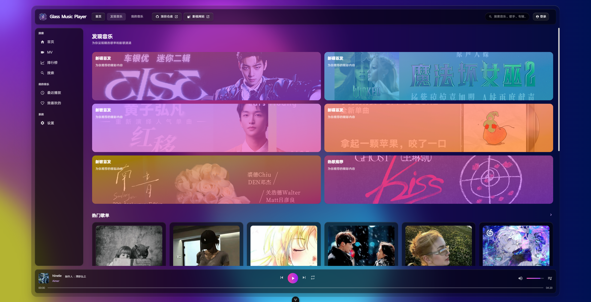</td>
    <td>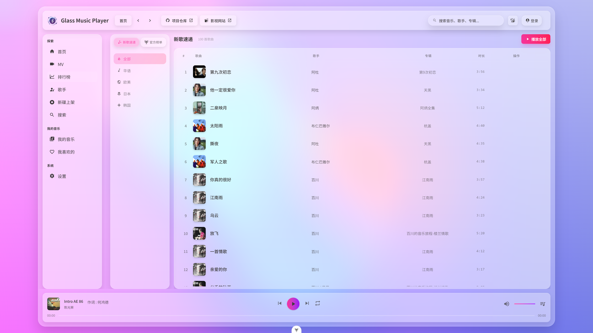</td>
  </tr>
  <tr>
    <td>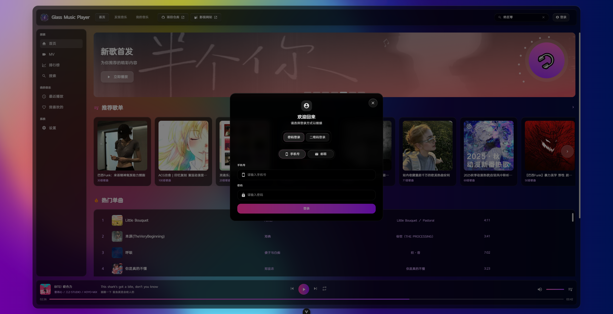</td>
    <td>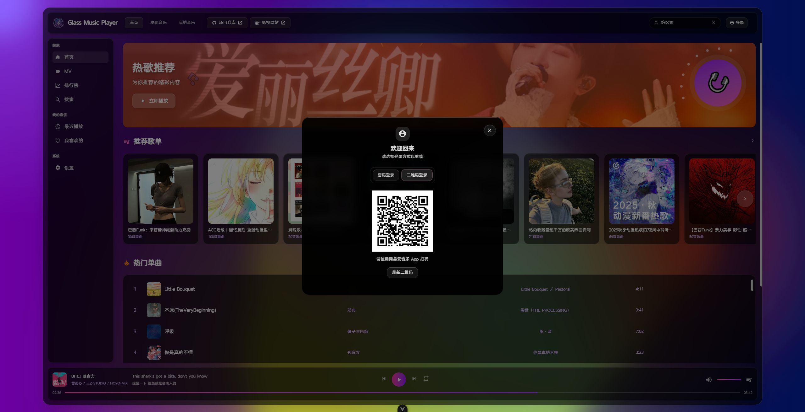</td>
  </tr>
  <tr>
    <td>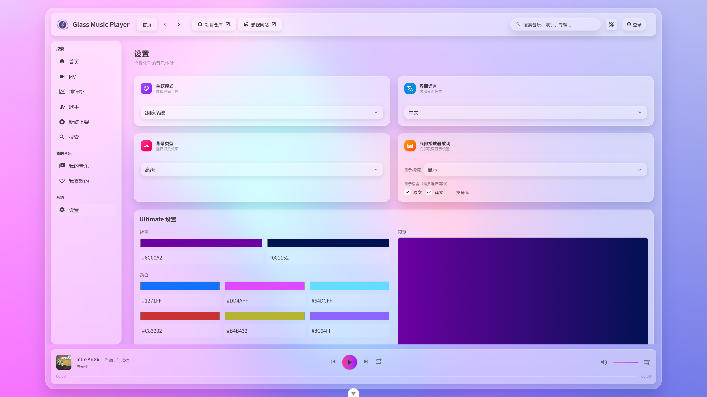</td>
    <td>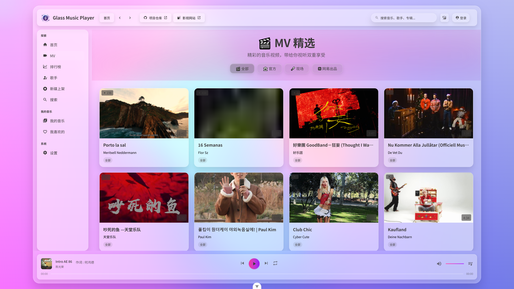</td>
  </tr>
  <tr>
    <td>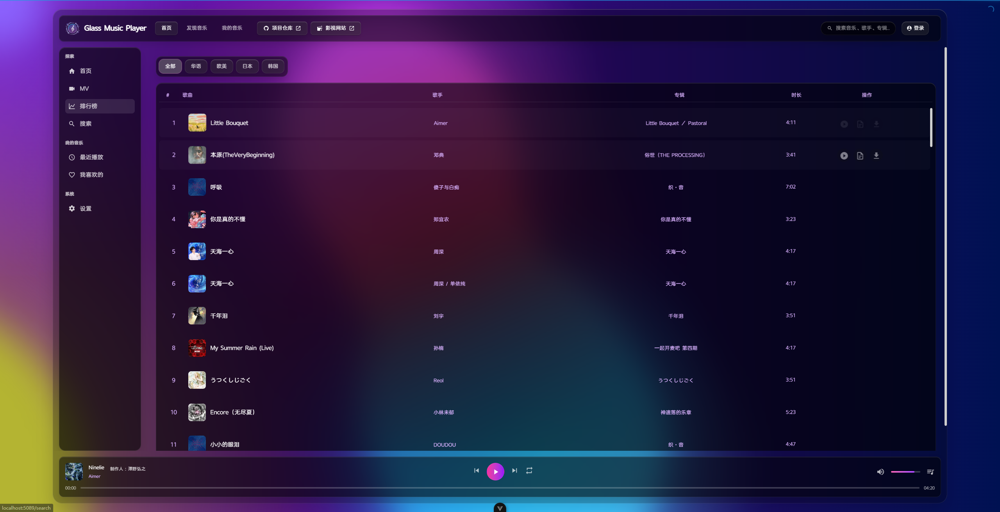</td>
    <td>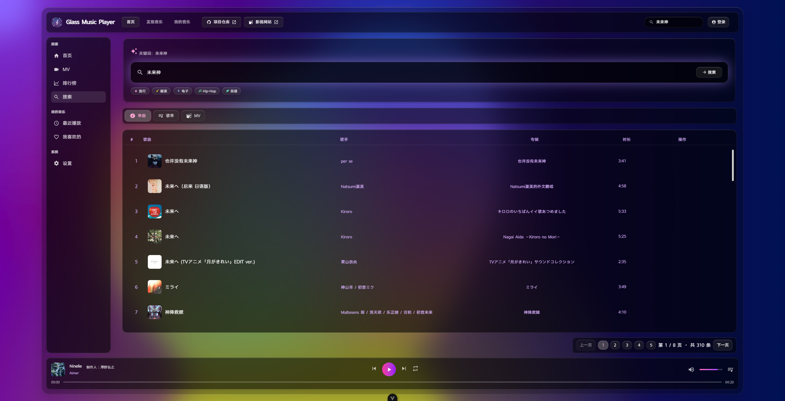</td>
  </tr>
  <tr>
    <td>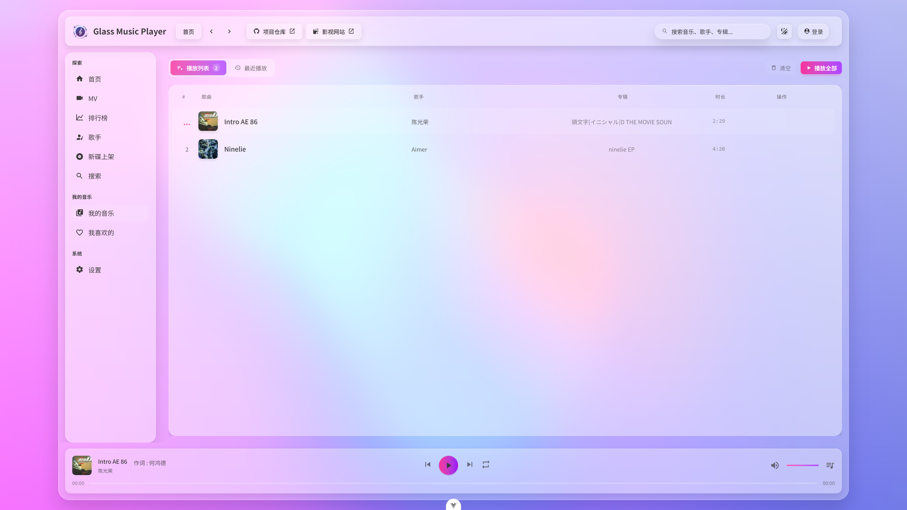</td>
    <td>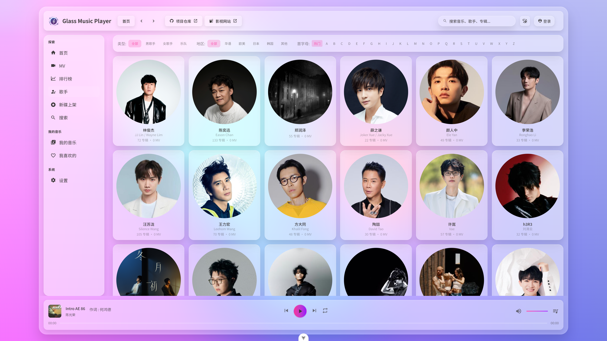</td>
  </tr>
  <tr>
    <td>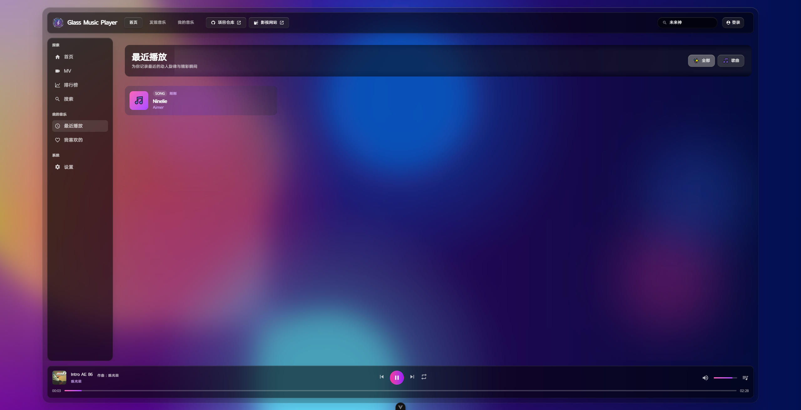</td>
    <td>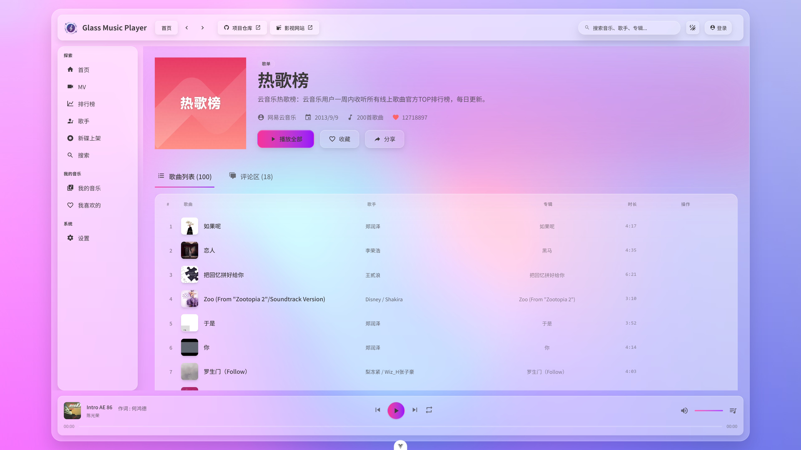</td>
  </tr>
  <tr>
    <td>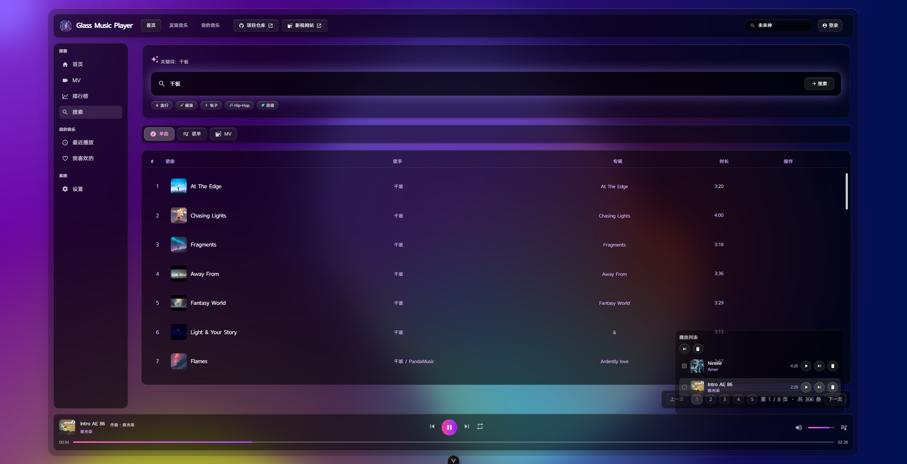</td>
    <td>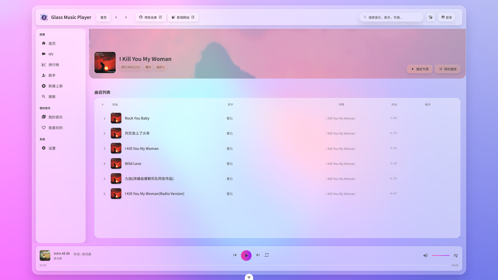</td>
  </tr>
  <tr>
    <td>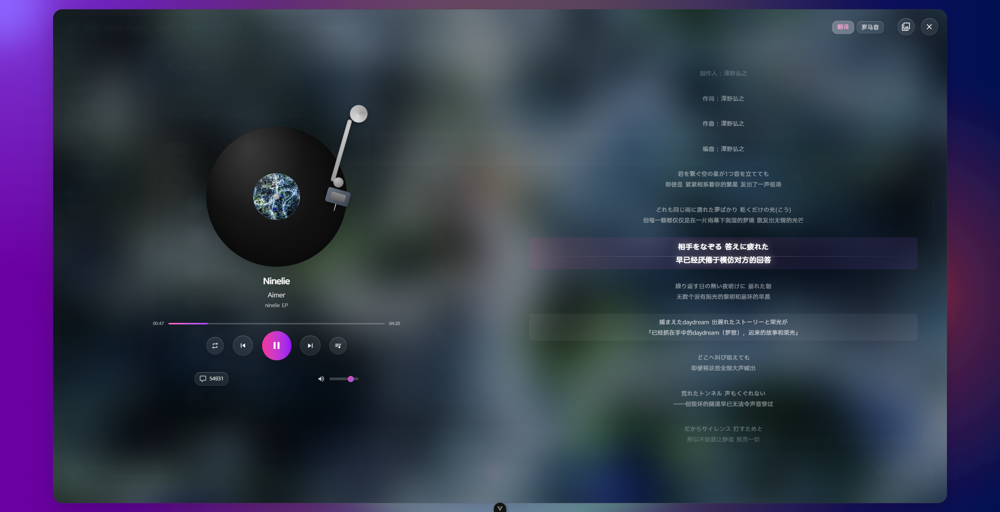</td>
    <td>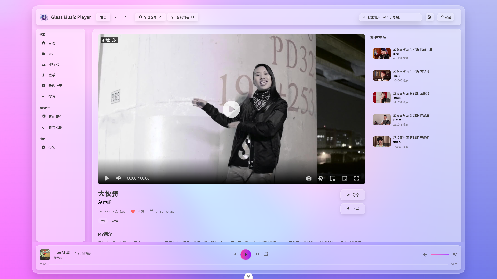</td>
  </tr>
</table>

### 移动端

<table>
  <tr>
    <td></td>
    <td></td>
  </tr>
  <tr>
    <td></td>
    <td></td>
  </tr>
  <tr>
    <td></td>
    <td></td>
  </tr>
  <tr>
    <td></td>
    <td></td>
  </tr>
  <tr>
    <td></td>
    <td></td>
  </tr>
</table>

<br/>

## ❓ 常见问题

<details>
<summary><strong>如何解决启动错误？</strong></summary>
<br/>
请确保 Node.js 版本 >= 22，并检查依赖安装时的错误信息。
</details>

<details>
<summary><strong>播放器如何更改主题？</strong></summary>
<br/>
在侧边菜单栏选择「设置」，可切换主题模式和背景主题。
</details>

<details>
<summary><strong>API 接口从哪里获取？</strong></summary>
<br/>

使用 [网易云音乐 API](https://neteasecloudmusicapi.vercel.app/#/)（可能需魔法上网）
</details>

<br/>

## ⚠️ 免责声明

本项目仅用于学习和研究目的。使用该项目的用户需自行承担相关风险。本项目所使用的相关 API 和数据源均为第三方提供，使用时请遵循相关法律法规及第三方的使用条款。**本项目不得用于任何商业目的**，我们不对任何由于使用本项目而引起的直接或间接的损失或法律责任负责。

<br/>

## 💬 交流与支持

<table>
<tr>
<td align="center">
<strong>QQ 交流2群</strong><br/><br/>

</td>
<td align="center">
<strong>QQ 交流群</strong><br/><br/>

</td>
<td align="center">
<strong>支付宝</strong><br/><br/>

</td>
<td align="center">
<strong>微信</strong><br/><br/>

</td>
</tr>
</table>

<br/>

## 📈 Star 趋势

[](https://starchart.cc/XiangZi7/KM-Music-Player)

<br/>

<div align="center">

**📄 License**

[PolyForm-Noncommercial-1.0.0](LICENSE)

Made with ❤️ by [XiangZi7](https://github.com/XiangZi7)

</div>
